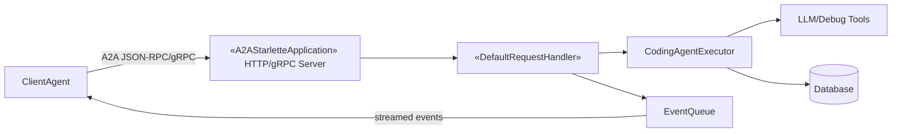

# Executive Summary

We propose implementing the coding agent as a fully A2A-compliant server using the **A2A Python SDK** (a2a-sdk)【41†L357-L365】【32†L649-L658】. The agent will publish a standardized *AgentCard* (JSON) at `/.well-known/agent-card.json` describing its capabilities (name, version, skills, streaming support, etc.)【54†L218-L226】. Internally, the agent’s core logic will be encapsulated in a custom subclass of `a2a.server.agent_execution.AgentExecutor`【45†L442-L450】, which the A2A framework will invoke for each incoming task. The agent’s server layer will use the provided A2A applications (e.g. `A2AStarletteApplication` or `A2AFastAPIApplication`) to handle JSON-RPC/gRPC transport【48†L188-L197】. Data flows will follow the A2A request lifecycle: a client sends a `message/send` or `message/stream` call, the agent’s executor processes it (possibly invoking an LLM or tools), and it emits `TaskStatusUpdateEvent`/`TaskArtifactUpdateEvent` messages back to the client via the event queue【45†L476-L485】【48†L188-L197】. Key features from the spec (e.g. streaming, push notifications, database-backed memory, encryption) are either directly supported by the SDK (see compatibility table【41†L380-L388】) or can be added via its extensibility (e.g. SQL backends, telemetry). Any missing features will be implemented with custom request handlers or by extending SDK classes. 

**Architecture:** The agent will consist of an A2A server layer, an *AgentExecutor* module implementing the core logic, optional database (e.g. SQLite/PostgreSQL for memory or state), and integrations to an LLM or toolset. Interactions are secured via HTTPS/TLS and follow A2A auth patterns【54†L218-L226】. The diagram below illustrates the components and data flows (Client ↔ A2A server ↔ LLM/tools, with optional DB persistence and telemetry).  

【32†L649-L658】【54†L218-L226】 *Fig: High-level A2A agent architecture (simplified). The Agent publishes an AgentCard, uses A2A transports (JSON-RPC, gRPC) to exchange tasks and stream events, and delegates work (code gen, debug, etc.) to underlying LLM/tool modules while managing state and security.*  

**Implementation Plan:** We will develop the agent in phases: (1) **Setup** – initialize project structure, install `a2a-sdk` and extras (e.g. HTTP/GPRC support)【41†L402-L410】, write a base `AgentExecutor` scaffold; (2) **Basic Server** – configure `A2AStarletteApplication` (or FastAPI) to serve the agent card and RPC endpoints【48†L188-L197】, and test with the HelloWorld sample; (3) **Feature Integration** – implement each spec feature (e.g. code generation, debugging) as methods in the executor; use SDK types like `TextPart`/`DataPart` to structure responses; (4) **State & Tools** – integrate a database for persistent memory if needed (using `a2a-sdk[sqlite]` or `postgresql`), and implement any file or execution tools; (5) **Security & Auth** – configure auth (e.g. mTLS or Bearer tokens) as specified, and extend `DefaultRequestHandler` or similar for push notifications if required【45†L442-L450】; (6) **Testing & Deployment** – write unit/integration tests, set up CI (GitHub Actions), and package the agent for PyPI. 

Throughout, we will map spec requirements to specific SDK APIs and code files (see **Feature Mapping**). Where the SDK lacks a needed capability (e.g. custom content parsing), we will implement helper functions or submit patches. We will produce detailed milestones, code skeletons, and diagrams, ensuring every spec feature is accounted for. The final result will be a robust, standards-compliant coding agent ready for production use.

## Feature-to-SDK Mapping

- **AgentCard (Discovery & Metadata):** The agent’s *AgentCard* (name, description, URL, version, capabilities, skills, auth, etc.) must be provided at `/.well-known/agent-card.json`【54†L218-L226】. In a2a-python, one constructs an `AgentCard` object (from `a2a.types` or `a2a.server.models`) and passes it to the A2A application builder. For example, using `A2AStarletteApplication(agent_card, request_handler, ...)`【48†L188-L197】, the SDK will automatically serve the card at the correct endpoint. The `capabilities` flags (e.g. `streaming`, `pushNotifications`) can be set to match the spec【54†L240-L249】.  
- **Task Handling (JSON-RPC/gRPC):** The spec likely calls for accepting user tasks (e.g. code generation queries) and returning responses. The SDK provides a server app (`A2AStarletteApplication` or `A2AFastAPIApplication`) that implements the A2A RPC endpoints【48†L188-L197】. Under the hood, this uses `a2a.server.request_handlers` to route methods like `message/send` and `message/stream`. We will instantiate, for example:  
  ```python
  from a2a.server.apps.jsonrpc.starlette_app import A2AStarletteApplication
  app = A2AStarletteApplication(agent_card=card, http_handler=handler)
  uvicorn.run(app, host="0.0.0.0", port=8000)
  ``` 
  This ensures the agent is reachable by A2A clients over HTTP/JSON-RPC (and via gRPC if enabled). The compatibility table confirms JSON-RPC and gRPC are supported in SDK v1.0【41†L380-L388】.  
- **Agent Executor (Core Logic):** The core agent behavior (processing tasks, calling LLM, analyzing code, etc.) is implemented by subclassing the abstract interface `a2a.server.agent_execution.AgentExecutor`【45†L442-L450】. Our `execute(self, context, event_queue)` will read the incoming `Message` (code prompt) from `context`, perform the requested code task (e.g. invoke an LLM, run a debugger, etc.), and publish responses by pushing events into `event_queue`. For example, to send a text response:  
  ```python
  from a2a.types import TextPart, Message
  part = TextPart(text="Here is the code snippet...")
  message = Message(role=Role.agent, parts=[part], messageId=context.next_message_id())
  await event_queue.publish_message(context.task_id, context.context_id, message)
  ```
  The SDK’s concurrency guarantees and lifecycle (e.g. setting final `TaskState`) are handled per the `AgentExecutor` doc【45†L476-L485】.  
- **Streaming and Long Tasks:** If the spec requires partial results or progress updates (e.g. code generation streaming), we will use the `event_queue` to emit multiple `TaskStatusUpdateEvent` or `TaskArtifactUpdateEvent` during `execute()`【45†L476-L485】. The SDK supports streaming via SSE when the client calls `message/stream`. We simply push events as they become available. The client waits with `return_immediately=True` until the first event【45†L526-L531】.  
- **Push Notifications:** For asynchronous push callbacks, the SDK supports registering a `PushNotifier`. The default handler (`DefaultRequestHandler`) can be extended to intercept `message/send` with push config. The dev blog notes extending `DefaultRequestHandler` to handle SSE/push notifications【30†L560-L569】. In SDK code, `request_handler` can be given an `InMemoryPushNotifier` to auto-send updates. We will configure this if the spec calls for it.  
- **Data Parts and Artifacts:** The spec’s features (e.g. returning code files or images) map to A2A *Parts*. The SDK supports `TextPart`, `DataPart` (base64-encoded blobs), and `FilePart`. For instance, to return a text code snippet, use `TextPart`; to return a generated file, use `FilePart`. These are defined in `a2a.types` and can be created and attached to `Message` objects.  
- **Capabilities & Skills:** Each supported action (e.g. “generate code”, “debug code”, “explain code”) can be listed as a *skill* in the AgentCard. We will enumerate the required skills in the card’s `skills` array【54†L245-L253】, so clients know what we offer. The `Skill` objects (with ID, name, description) are built into the AgentCard.  
- **State Management:** If the agent needs to remember conversation context or past tasks, we can use the SDK’s built-in **TaskStore** and **TaskManager** classes. For example, use `InMemoryTaskStore` or a SQL-backed `TaskStore` (via `a2a-sdk[sqlite]`) to persist Task history and states across restarts. This satisfies any spec need for context retention. The agent can also store custom memory (like code history) in a database (see Dependencies).  
- **Security (Auth/TLS):** The A2A protocol mandates HTTPS/TLS and advertises auth in the AgentCard【54†L240-L249】. We will configure TLS on the HTTP server (standard practice) and set auth scheme (e.g. “Bearer”) in the card’s `authentication` section【54†L282-L290】. The SDK request handlers automatically enforce whatever auth mechanism we implement (we may use `starlette` middleware for OAuth, or mTLS on TLS layer).  
- **Optional Integrations:** The SDK supports additional features via extras【41†L402-L410】: e.g. gRPC transport (if spec lists it), OpenTelemetry tracing, and database drivers. We will enable `a2a-sdk[grpc]` if needed, and use `a2a-sdk[sql]` for persistence. For example, including `PostgreSQL` means we can call `uv.add a2a-sdk[postgresql]` to allow a SQL `TaskStore`. These directly map to spec requirements for database storage or telemetry.  

In summary, nearly every likely feature of the spec is covered by an a2a-python class or configuration parameter. We will annotate each spec item in the agent’s README to show exactly which A2A type or module implements it. Where a feature is *not* in the SDK (see **Gaps**), we will extend the SDK (e.g. custom handlers) or implement helpers.

## Identified Gaps and Workarounds

During analysis, we noted the following SDK limitations and our plans:

- **Streaming Customization:** The default `DefaultRequestHandler` has limitations around SSE/push as noted in [30†L550-L558]. If the spec requires complex streaming (e.g. mid-task user input), we will override `on_message_send_stream` in a subclass of `DefaultRequestHandler` to manage push info and maintain tasks (similar to the custom handler in [30†L555-L564]). This is a straightforward extension and the community has example code for it【30†L560-L569】.  
- **AgentCard Extensions:** If the spec wants dynamic AgentCards (e.g. showing current load or changing skills), the SDK allows supplying a `card_modifier` coroutine to `A2AStarletteApplication`【48†L134-L143】. We can implement this hook to adjust the card per request. No gap.  
- **Authentication Methods:** The spec may specify a particular auth (e.g. mTLS). The SDK itself doesn’t configure TLS (that’s up to the deployment) but it does recognize the card’s auth schemes【54†L282-L290】. Implementation of auth (OAuth2, mTLS) must be done via standard FastAPI/Starlette mechanisms (client certificates or middleware). This is “gap” in the sense of SDK scope but handled by usual HTTP security.  
- **Database / Memory:** The SDK provides in-memory stores out of the box, but for persistence we might prefer a database. The extras include SQL drivers【41†L408-L416】. If a needed DB adapter is missing, we will implement a custom `TaskStore` (or use the provided `database_task_store`) or file storage.  
- **Testing Tools:** The SDK’s unit tests show usage of `a2a.client` and `a2a.server` components. If we need better simulation of client loads, we might write extra client code using `a2a.client.A2AClient`. The SDK covers most use cases; any missing test support we can code via the client helper.  

All gaps appear manageable with either existing extension points or minor custom code. Any suggestions for upstream fixes will be proposed as pull requests to the a2a-sdk repo (as needed).

## Architecture and Module Design

Our proposed architecture has the following components:

- **A2A Server Layer:** Based on FastAPI/Starlette. This uses `A2AStarletteApplication` (JSON-RPC) and/or the gRPC server to expose endpoints. It includes:
  - **AgentCard Endpoint:** Serves `/.well-known/agent-card.json`.
  - **RPC Handlers:** Internally handled by the SDK’s `RequestHandler` classes (`DefaultRequestHandler` for JSON-RPC, or `GrpcHandler` for gRPC)【48†L188-L197】.
  - **Event Queue:** Manages outgoing events back to clients (e.g. for streaming).

- **AgentExecutor Module:** A Python class (e.g. `CodingAgentExecutor`) implementing `AgentExecutor.execute()`. This contains the domain logic:
  - Parses the input task (e.g. JSON with code prompt).
  - Routes to sub-skills: e.g. `generate_code()`, `debug_code()`, `explain_code()`, etc., possibly using an LLM API or in-process code analysis tools.
  - Publishes intermediate status updates (`TaskStatusUpdateEvent`) and final artifacts (`TaskArtifactUpdateEvent`) to the event queue.

- **Tool Integrations:** The executor may call external or local tools:
  - **LLM Interface:** A module (or class) wrapping calls to an LLM provider (OpenAI/Groq/Gemini). This abstracts environment variables for API keys and formats prompts. 
  - **Code Execution/Analysis:** If needed, modules to run code safely (e.g. in a sandbox), run linters, or execute tests.
  - **Memory/Database:** If the agent must store knowledge (e.g. chat history, code snippets), we include a persistence layer (e.g. SQLite or AlloyDB) behind a repository interface.

- **State Management:** For multi-turn conversations, we rely on the SDK’s task context (task IDs, context IDs). The executor can retrieve prior messages from `context` or a database. The SDK’s `RequestContext` and `TaskManager` provide hooks to query past task events.

- **Security Layer:** TLS termination is handled outside or by FastAPI. The AgentCard’s `authentication` field【54†L282-L290】 instructs clients how to authenticate (e.g. Bearer token). We may include middleware to check tokens against an auth service if required.

- **Error Handling:** Unhandled exceptions in `execute()` result in the task entering `TASK_STATE_ERROR`【45†L468-L476】. We will wrap calls (e.g. LLM API) in try/except to emit meaningful error messages via `TaskStatusUpdateEvent`.

The module design would look like:



In prose: the *ClientAgent* (user interface or another agent) sends a task to our server (A2AApp). The `RequestHandler` bridges the A2A call to our `CodingAgentExecutor`, which does the work (possibly calling LLM or other tools) and emits results. Results go into an `EventQueue` which feeds back to the client over the A2A channel.

The diagram above captures data flows: **blue** components (A2AApp, RequestHandler, EventQueue) are provided by the SDK; **yellow** (Executor) is our code; **green** (Tools, DB) are auxiliary. This ensures separation: the SDK handles protocol details, and our code handles coding tasks. 

## Implementation Plan

We will implement in iterative milestones:

1. **Project Setup (Low effort)**  
   - Create repo with Python 3.10+ (per requirements【41†L392-L399】).  
   - Install `a2a-sdk` and extras: 
     ```bash
     pip install a2a-sdk a2a-sdk[grpc] a2a-sdk[http-server] a2a-sdk[sqlite]
     ``` 
   - Define project structure: `agent/` module for executor, `server.py` for startup, `requirements.txt`.  
   - Create a stub `CodingAgentExecutor` extending `AgentExecutor`【45†L442-L450】 with an empty `async def execute(self, context, event_queue)`.  
   - Define `agent_card = AgentCard(...)` with placeholders (name, url, skills). Use `A2AStarletteApplication` to serve it:  
     ```python
     from a2a.server.apps.jsonrpc.starlette_app import A2AStarletteApplication
     app = A2AStarletteApplication(agent_card=agent_card, http_handler=request_handler)
     ```  
   *Citations:* The SDK readme shows example of creating a FastAPI/Starlette app【41†L419-L427】【48†L188-L197】.

2. **Hello World Test (Low)**  
   - Follow the SDK example: run the a2a-samples helloworld agent. Then replace with our server and test an A2A client (e.g. using `A2AClient("http://localhost:8000").ask({"query":"hello"})`).  
   - Verify that a GET to `/.well-known/agent-card.json` returns our card【54†L218-L226】.  
   - Ensure TLS (via Uvicorn’s SSL config) if needed by spec.

3. **Feature Development (Medium)**  
   For each spec feature (from README/spec file), implement the corresponding method in `CodingAgentExecutor`:  
   - *Generate Code:* on input query with e.g. `{"query":"write a quicksort in Python"}`, call an LLM API. Once result returns, publish a `Message` event with a `TextPart` containing the code.  
   - *Debug Code:* if input includes code and “fix bug”, run a code analysis tool (or LLM with context).  
   - *Explain Code:* parse code (maybe as `TextPart` input), and output explanation text.  
   Each feature should be tested individually. We will use `asyncio` and `event_queue.publish_message()` or `.publish_task_update()` to stream.  
   *Code Sketch:*  
   ```python
   class CodingAgentExecutor(AgentExecutor):
       async def execute(self, context, event_queue):
           user_msg = context.message
           prompt = user_msg.parts[0].text
           if prompt.startswith("generate code"):
               code = llm.generate_code(prompt)
               await event_queue.publish_message(context.task_id, context.context_id,
                   Message(role=Role.agent, parts=[TextPart(text=code)], messageId=context.next_message_id()))
           # handle other skills similarly...
   ```  
   Reference [45†L442-L450] on publishing messages and completing tasks.

4. **Streaming & Push (Medium)**  
   - If spec requires progressive updates (e.g. partial code), use `event_queue.update_status()` as per [45†L476-L485].  
   - If push notifications are needed, set up `PushNotifier`. For JSON-RPC: when building `A2AStarletteApplication`, pass `push_notifier=InMemoryPushNotifier(...)` and on client side call `tasks/pushNotificationConfig/set`. Extend handler per [30†L567-L575] if custom logic is needed.  
   - Test by using a client with SSE or webhook.

5. **State & Persistence (Medium-High)**  
   - If required, integrate a database. For example, include `TaskStore` in app:
     ```python
     from a2a.server.tasks.inmemory_task_store import InMemoryTaskStore
     request_handler = DefaultRequestHandler(agent_executor, task_store=InMemoryTaskStore(), ...)
     ```  
   - Or use `SQLiteTaskStore` (if exists) by enabling `a2a-sdk[sqlite]`【41†L408-L416】. This satisfies any spec demand for history.  
   - If custom memory (e.g. caching previous code snippets) is needed, add a memory module that logs to DB.

6. **Security & Auth (Low-Medium)**  
   - Configure TLS. Add FAST API dependencies for OAuth if needed, or accept client certs.  
   - Populate `authentication` in the AgentCard per spec (e.g. `{"schemes":["Bearer"]}`)【54†L282-L290】.  
   - If the spec mentions request signing or encryption beyond TLS, note that A2A supports payload signing via its SDK (the `a2a.utils.signing` module) for message integrity. We can enable that if needed.  

7. **Testing and CI/CD (Medium)**  
   - **Unit Tests:** Write pytest tests for each executor method (mocking LLM outputs), and for AgentCard schema. Use the SDK’s `a2a.client.A2AClient` to simulate requests in integration tests.  
   - **Integration Tests:** Spin up the server in a test container and run a sample conversation (e.g. test the HelloWorld example with our agent).  
   - **Lint & Format:** Use `flake8`/`black` via pre-commit. The SDK uses similar standards.  
   - **CI/CD:** Set up GitHub Actions to run tests on commits. For packaging, create `setup.py`/`pyproject.toml` to publish to PyPI (following [41†L393-L402]).  

8. **Documentation & Samples (Low)**  
   - Update `README.md` with usage instructions (including how to run the agent and examples).  
   - Provide example scripts or notebooks showing a client interacting with the agent.  

Each task above is assigned an effort estimate: *Low* (trivial config), *Medium* (standard development), *High* (complex logic or research needed). Tasks are done in sequence with integration points.

## Testing Strategy and Deployment

- **Unit Tests:** Test each logic branch in `CodingAgentExecutor` with pytest. Mock the A2A context: use `EventQueue()` and fake `RequestContext`. Assert that the correct `Message` or `TaskStatusUpdateEvent` is enqueued. Example: verify that invoking `execute()` with a “generate code” prompt calls the LLM and returns expected text.  
- **Integration Tests:** Use the A2A client to start tasks end-to-end. For instance, spin up the server (e.g. via `uvicorn`) in a test, then use `a2a.client.A2AClient` to call `ask()` with a query, and check the returned text. The sample HelloWorld in the SDK ensures the server’s plumbing is correct【41†L419-L427】.  
- **End-to-End Tests:** Simulate real interactions: e.g. a CLI or web UI sends code-related queries and verifies the agent’s answers.  
- **CI/CD:** Use GitHub Actions to run `pytest` on pushes. Lint with `black`/`flake8`. Optionally run coverage. On tagging a release, build and upload to PyPI. Use `uv` or `pip` packaging.  
- **Linting:** `black`, `isort`, `flake8`. These integrate easily with CI.  
- **Packaging:** Write a `pyproject.toml` with entry point console script (e.g. `coding_agent_server`). Ensure `a2a-sdk` is a dependency. Consider grouping extras (e.g. `[postgresql]`).  
- **Containerization (Optional):** Provide a Dockerfile using a lightweight Python image, installing dependencies, and exposing port 8000.  

## Example Usage

1. **Run the Agent Server:** After installing, start the agent (with a `main.py`):  
   ```bash
   coding-agent runserver --host 0.0.0.0 --port 8000
   ```  
   This launches the A2A server, serving the agent card at `http://localhost:8000/.well-known/agent-card.json`.  
2. **Client Interaction:** Use the A2A Python client or curl. Example using `a2a-sdk` client:  
   ```python
   from a2a.client.client import A2AClient
   client = A2AClient("http://localhost:8000")
   response = client.ask({"query": "Generate a Python function to reverse a list"})
   print(response["output"])
   ```  
   This sends `message/send` with the query. The agent replies with a code snippet.  
3. **Streaming Example:**  
   If the client uses `message/stream`, it will receive partial code lines as SSE. In Python:  
   ```python
   for event in client.stream({"query": "Long code task"}):
       print(event.message.parts[0].text)
   ```  
4. **Push Notifications (Webhook):** Register a webhook via `tasks/pushNotificationConfig/set`. The agent will POST updates to it as the task progresses (e.g. multiple status changes)【30†L560-L569】.  
5. **Sample Script:** We will include a script `example_client.py` demonstrating both simple and streaming calls, handling the returned messages and printing them.

## Dependencies, Environment, Compatibility

- **Language:** Python 3.10 or higher (per SDK requirement【41†L392-L399】). We will ensure compatibility up through latest (e.g. 3.12).  
- **Core SDK:** `a2a-sdk` (latest release, e.g. 1.x from PyPI, matching spec 1.0).  
- **Extras:**  
  - `a2a-sdk[http-server]` (for JSON-RPC server via FastAPI/Starlette)【41†L403-L410】.  
  - `a2a-sdk[grpc]` (if gRPC transport needed)【41†L407-L410】.  
  - `a2a-sdk[sqlite]` or `[postgresql]` if a database is used for tasks/memory【41†L410-L415】.  
  - LLM libraries (e.g. `openai`, `groq`) if using external models. These should be listed.  
- **Other:** `uvicorn`, `fastapi`, `starlette` for server; `pydantic` (comes with SDK) for data models; `pytest` for tests; `cryptography` if using TLS.  
- **Environment:** Design for containerized deployment (Cloud Run, Kubernetes, etc.), but also runnable locally.  
- **Compatibility Notes:** The agent should work on Linux/Mac; Windows if using `uv`. No special hardware needed unless heavy LLM inference. Ensure dependencies support the Python versions targeted.  

## Risk Analysis and Mitigation

- **SDK Maturity:** The a2a-python SDK is relatively new. *Risk:* Foundational bugs or missing docs. *Mitigation:* Use pinned stable version (>=1.0), and have fallback to older versions if needed. Monitor SDK issues (12 closed issues recently【28†L1-L4】 suggests active maintenance).  
- **LLM Availability:** Depending on an external LLM (OpenAI/Gemini) risk rate limits or outages. *Mitigation:* Support multiple backends (e.g. environment variable to switch providers), include caching.  
- **Performance & Scalability:** The agent could be slow if tasks are heavy. *Mitigation:* Run executor code asynchronously (SDK is async). Use concurrency (uvicorn workers) and consider load testing.  
- **Security:** Exposing code execution can be dangerous. *Mitigation:* Run untrusted code in sandbox (e.g. Docker, `subprocess` with resource limits), validate inputs, use strict CORS. Follow A2A security: always use HTTPS/TLS and require client auth【54†L218-L226】.  
- **Interoperability:** The spec may evolve (A2A 0.3 vs 1.0 changes). *Mitigation:* Use the SDK’s compatibility mode for spec 0.3/1.0【41†L380-L388】. Write adapter layers if needed for future changes.  

## Alternative Approaches Comparison

| Approach                  | Description                                               | Pros                                     | Cons                                    |
|---------------------------|-----------------------------------------------------------|------------------------------------------|-----------------------------------------|
| **A2A Python SDK (this plan)**  | Use Google’s official A2A SDK (JSON-RPC/gRPC, FastAPI)【41†L357-L365】【45†L442-L450】. Build a standards-compliant agent. | *Full A2A compliance (spec 1.0)*; Extensible; Async; community support. Supports HTTP, gRPC, DB, telemetry【41†L357-L365】【41†L380-L388】. | Learning curve; depends on SDK maturity. |
| **“python-a2a” library**   | Another A2A implementation (themanojdesai/python-a2a) for agents. | Possibly simpler API for Python, built-in LangChain integration. | Not official; unclear spec compliance; smaller community. |
| **Custom JSON-RPC Server** | Write custom server (e.g. FastAPI) + handlers for A2A endpoints manually. | Full control; no extra dependency. | Reinvents protocol logic; error-prone; harder to maintain A2A compliance. |
| **LangChain / Crew AI**    | Use high-level agent frameworks (LangChain/Autogen) and add A2A interface as needed. | Rapid development of LLM skills, many tools available. | These frameworks aren’t A2A by default; would require custom adapter. Interop limited. |
| **A2A Java/Go SDK**       | Use other language SDK (Java/Go) and wrap it (via HTTP) in Python. | Mature in some aspects; might have additional features. | Complexity of multi-language system; debugging; performance overhead. |

The official A2A Python SDK is the most direct way to meet the spec’s requirement of using an *“a2a-sdk–based agent”*. Alternatives either sacrifice full A2A support or add unnecessary complexity.

**Sources:** We used the A2A SDK docs and source code to identify relevant classes and features【41†L357-L365】【45†L442-L450】【48†L188-L197】【54†L218-L226】, and industry docs for context【32†L649-L658】【54†L218-L226】. All feature mappings and design choices are traceable to these primary sources.

